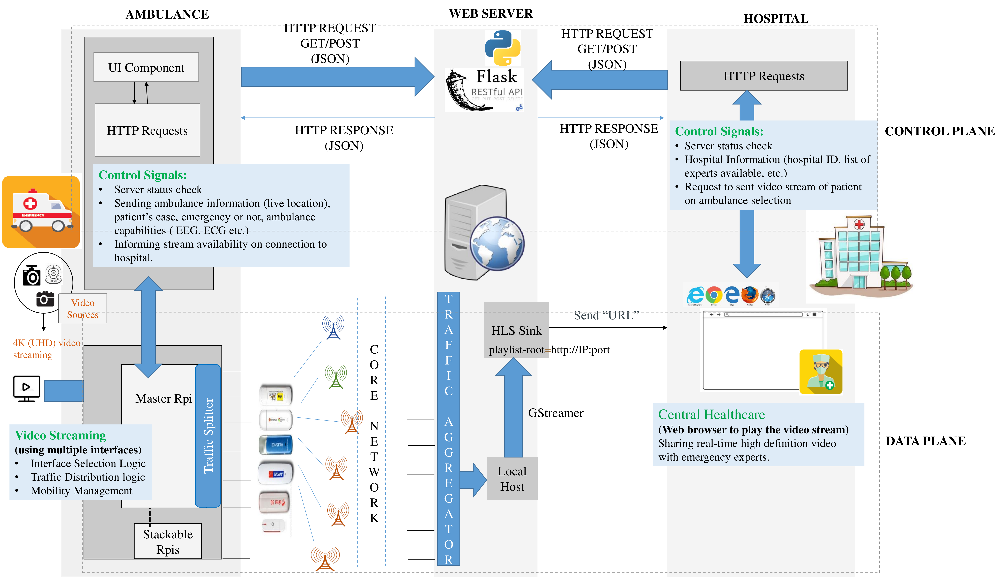
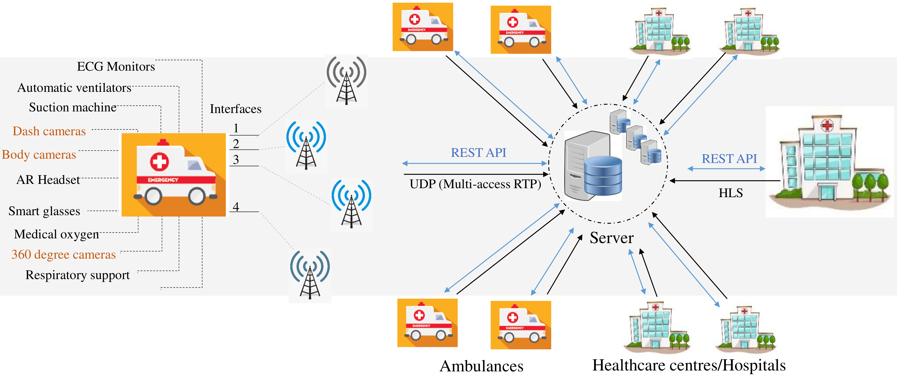
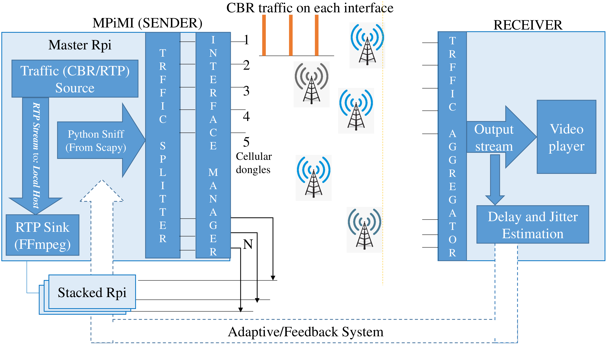
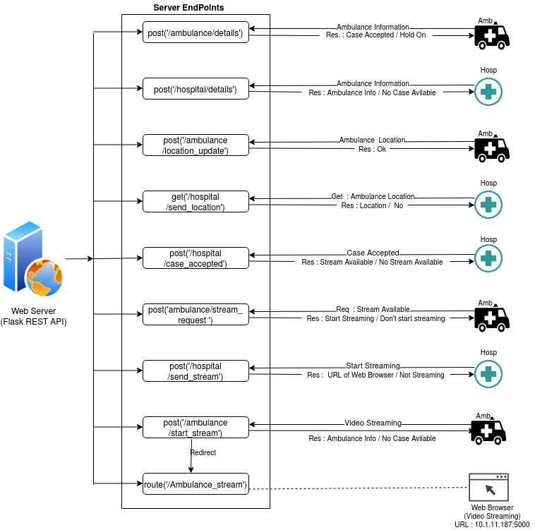
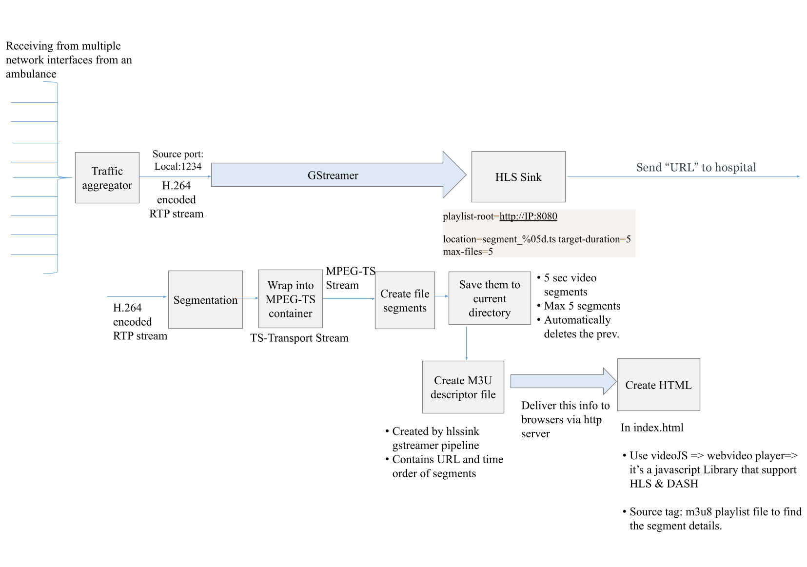

# Summary

- There is a growing synergy between healthcare and emergency response systems to bolster patient care, particularly through smart-ambulance services. These services continually evolve to meet healthcare needs, requiring concurrent upgrades within hospitals for swift and efficient services.

- One key solution involves a multi-access solution for streaming ultra-high-definition video in the uplink from mobile systems. This solution intelligently divides and distributes video traffic across multiple network interfaces, incorporating inter-stream coding to ensure reliable transmission. The primary goal is to enhance and manage end-to-end delay and jitter performance in multi-access scenarios.

- A standardized set of APIs is proposed to access smart-ambulance services, providing live data for improved information utilization. This empowers hospital systems to be highly responsive and adaptable during critical situations in patient care's pre-hospital and post-hospital phases.

- The implementation of these ideas at a product level is shared, along with real-world results. Detailed explanations of the front-end and back-end procedures are provided to validate the effectiveness of the proposed algorithms in enhancing patient care and healthcare system responsiveness.

Self-explanatory illustrative diagrams are shown below. The images are of high quality, which might take some time to load. If it still doesn't load, please click on the image links, switch browser, or go to the image folder (https://github.com/khushboo28sahu/smart-ambulance-services/tree/main/assets).

## System Model

System Model for Multi-interface based Smart Ambulance.

## Applications

Application scenario.

## System Setup

Multi-LTE interface system setup.

## Server

Server APIs.

## Video Streaming

GStreamer-based video upstreaming pipeline.

## Contact info
For any questions, please reach out at 

- bhaveshs@iitbhilai.ac.in
- khushboos@iitbhilai.ac.in

